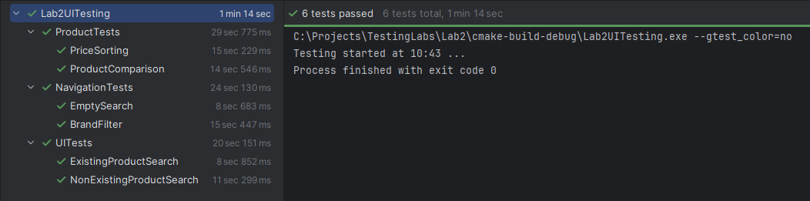

# Lab 2 — Automated UI Testing in C++

## Автор

Ключніков Олександр Євгенович
ІПС-21

---

## Мета роботи

Набуття практичних навичок автоматизації тестування користувацького інтерфейсу веб-застосунків та ознайомлення з принципами побудови автоматизованих тестів.

---

## Використані технології

* **C++17**
* **Google Test**
* **CMake**
* **PowerShell / Clion 2025.2.4**

---

## Структура проєкту

```text
Lab2UITesting/
├── Lab2UITesting/
│   └── main.cpp
├── tests/
│   └── UITests.cpp
│   └── NavigationTests.cpp
│   └── ProductTests.cpp
├── images/
│   └── tests.png
├── README.md
└── CMakeLists.txt
```

---

## Реалізовані тестові сценарії

У межах лабораторної роботи реалізовано 6 автоматизованих тестів:

1. **ExistingProductSearch** — перевірка пошуку існуючого товару
2. **NonExistingProductSearch** — перевірка пошуку неіснуючого товару
3. **EmptySearch** — перевірка порожнього пошукового запиту
4. **BrandFilter** — перевірка фільтрації за брендом
5. **PriceSorting** — перевірка сортування за ціною
6. **ProductComparison** — перевірка порівняння товарів

---

## Результати виконання тестів

| ID    | Назва тесту              | Статус |
| ----- | ------------------------ | ------ |
| T-01 | ExistingProductSearch    | Pass   |
| T-02 | NonExistingProductSearch | Pass   |
| T-03 | EmptySearch              | Pass   |
| T-04 | BrandFilter              | Pass   |
| T-05 | PriceSorting             | Pass   |
| T-06 | ProductComparison        | Pass   |

### Підсумок

* **Всього тестів:** 6
* **Успішно:** 6
* **Помилок:** 0
* **Failures:** 0

---

## Скріншот запуску тестів



---

## XML звіт

Результати тестування також збережені у файлі:

```text
test_report.xml
```

Усі тести пройдені успішно.

---

## Висновок

У ході виконання лабораторної роботи було реалізовано автоматизоване тестування із застосуванням C++, Google Test та CMake.
Розроблено набір тестів для перевірки ключових користувацьких сценаріїв: пошуку, фільтрації, сортування та порівняння товарів.
Усі 6 тестів були виконані успішно, що свідчить про коректність реалізованої логіки.
